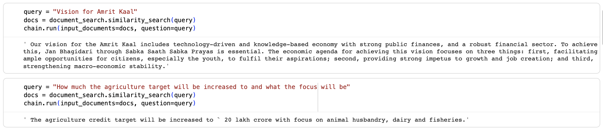
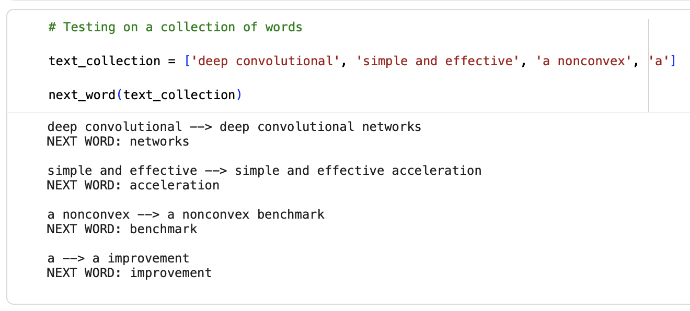
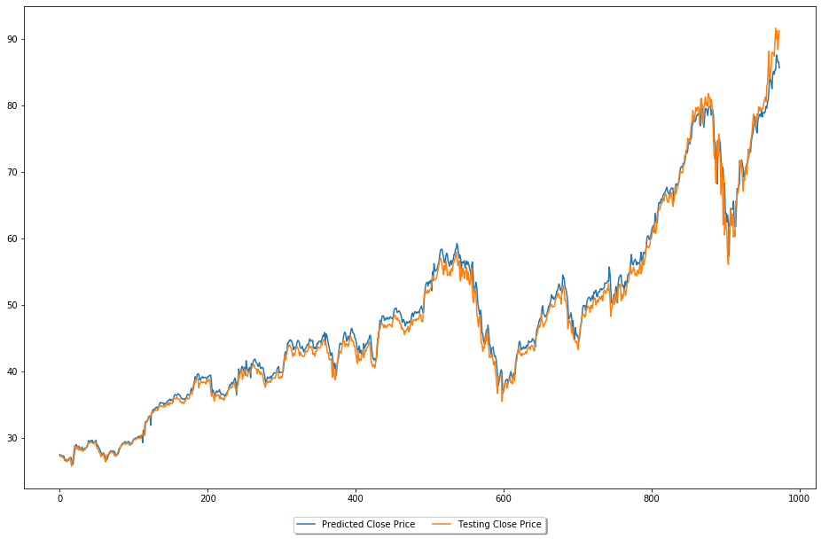
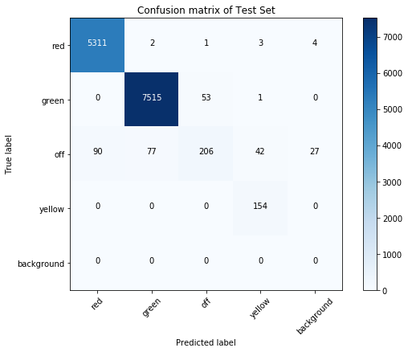
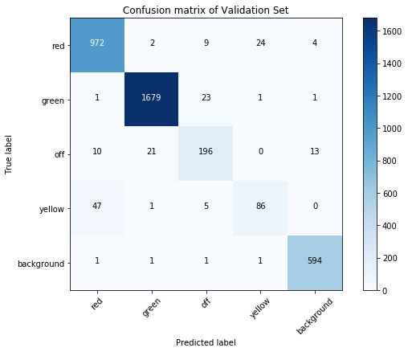
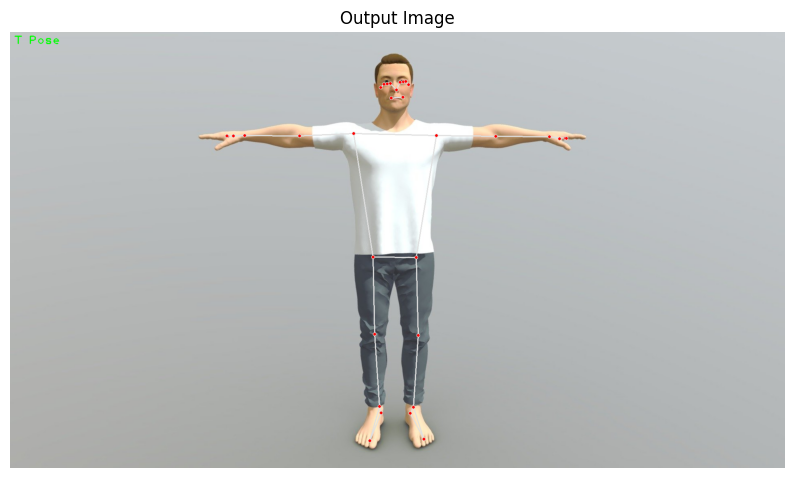
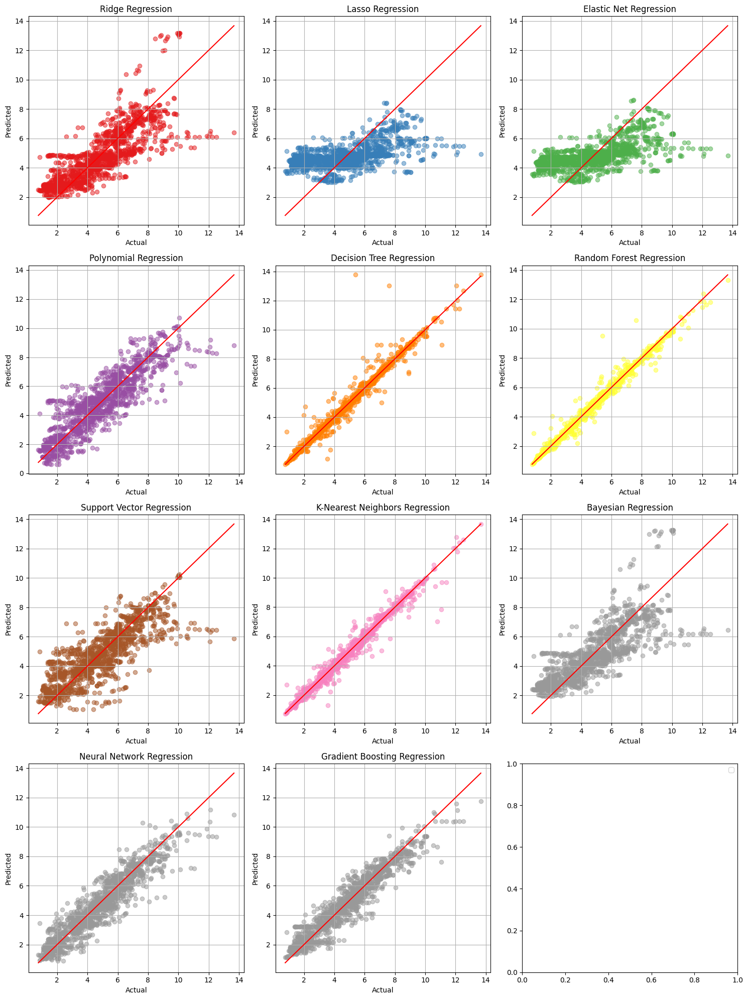
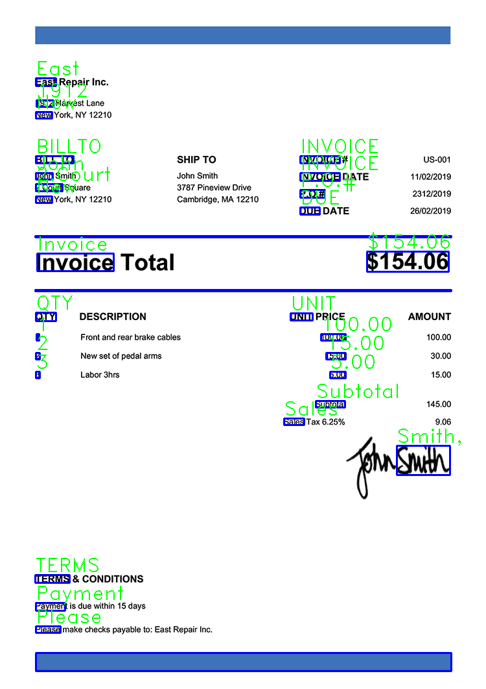

# 🧠 Undergraduate Projects — Experiments in ML, CV, NLP & AI Systems

Welcome! 👋  
This repository contains a collection of projects and experiments I built during my undergraduate studies as part of exploring machine learning, computer vision, and natural language processing concepts.  
Each notebook represents **hands-on experimentation**, learning, and iteration — not polished products.  

For detailed write-ups and results, please visit my [LinkedIn Projects section](https://www.linkedin.com/in/jainil-rana-ba0663224/details/projects/).

---

## 📚 Table of Contents
1. [PDF Q&A with LangChain + FAISS](#-pdf-qa-with-langchain--faiss)
2. [Abstractive Text Summarization (Prototype)](#-abstractive-text-summarization-prototype)
3. [Next-Word Prediction](#-next-word-prediction)
4. [Stock Price Prediction with News Sentiment](#-stock-price-prediction-with-news-sentiment)
5. [Traffic Light Classification](#-traffic-light-classification)
6. [Real-Time Pose Detection](#-real-time-pose-detection)
7. [Mental Fitness Tracker](#-mental-fitness-tracker)
8. [Invoice OCR Pipeline](#-invoice-ocr-pipeline)
9. [Music Recommendation — Churn/Likeliness Model](#-music-recommendation--churnlikeliness-model)

---

## 📄 PDF Q&A with LangChain + FAISS

**Summary:**  
Built an end-to-end retrieval-augmented QA system that ingests PDFs, chunks text, embeds it, and answers natural-language questions over the corpus using FAISS + LangChain.

**Highlights:**
- Robust PDF loader & text normalizer  
- ~800-character chunks with 200 overlap  
- 149 chunks embedded & indexed in FAISS for sub-second search  
- RetrievalQA chain with prompt templates, source tracking, and configurable k-NN  
- Reduced manual PDF lookup from minutes to seconds  

**Skills:** `Retrieval-Augmented Generation (RAG)` · `FAISS` · `Vector Indexing` · `Chunking` · `Prompt Design`

---

## 🧾 Abstractive Text Summarization (Prototype)

**Summary:**  
Fine-tuned **Pegasus** for dialogue summarization on the SAMSum dataset to benchmark abstractive text generation under limited compute.

**Highlights:**
- Processed 14k+ dialogues with tokenization & length control  
- Used gradient accumulation for small-GPU training  
- Evaluated with ROUGE & qualitative analysis  
- Served as baseline for future hyperparameter sweeps  

**Skills:** `Hugging Face` · `seq2seq` · `Fine-Tuning` · `ROUGE` · `Handling Long Dialogues`

---

## 🔤 Next-Word Prediction (USE + Dense Classifier)

**Summary:**  
Prototype next-word predictor using Universal Sentence Encoder embeddings with a dense classification head.

**Highlights:**
- Preprocessed 7.2k lines, 2.6k unique tokens  
- Encoded contexts via USE; trained compact MLP  
- 100% validation accuracy on small split (sanity check)  
- Built interactive inference cell for quick demos  

**Skills:** `Text Preprocessing` · `Word Embeddings` · `TF-Hub` · `Prototype Development`

---

## 📈 Stock Price Prediction with News Sentiment

**Summary:**  
Forecasted **AAPL** closing prices using LSTM with combined OHLCV + sentiment features.

**Highlights:**
- Engineered rolling features (lags, averages, volatility)  
- LSTM sequence modeling with dropout & scaling  
- Achieved RMSE ≈ 50.3 on test data  
- Enabled measurable benchmark against AR/EMA models  

**Skills:** `Time Series Analysis` · `Feature Engineering` · `Sentiment Analysis` · `LSTM`

---

## 🚦 Traffic Light Classification

**Summary:**  
Trained a compact CNN to classify traffic-light states (green, red, yellow, off, background) for ADAS-style scenarios.

**Highlights:**
- 5-class dataset, input normalized to 64×64×3  
- Used Conv–BN–ReLU blocks + GAP + Softmax  
- 95.5% validation accuracy  
- Lightweight model suitable for edge deployment  

**Skills:** `TensorFlow` · `Keras` · `Augmentation` · `Regularization`

---

## 🕺 Real-Time Pose Detection

**Summary:**  
Implemented real-time pose landmark detection using MediaPipe with OpenCV visualization.

**Highlights:**
- Tuned inference for stability & low jitter  
- Frame capture + pose inference + drawing overlays  
- Per-frame inference time and detection confidence tracked  

**Skills:** `Realtime CV Pipelines` · `OpenCV` · `MediaPipe` · `Performance Profiling`

---

## 🧩 Mental Fitness Tracker (Multi-Model Regression)

**Summary:**  
Predicted a continuous “mental fitness” score using multiple regression models.

**Highlights:**
- 12-model sweep (Ridge, Lasso, GBM, SVR, KNN, MLP, etc.)  
- Feature pipelines with rolling windows & interactions  
- KNN achieved R² = 0.9786, MSE = 0.1094  

**Skills:** `Model Selection` · `Regression` · `Feature Engineering`

---

## 🧾 Invoice OCR Pipeline

**Summary:**  
Implemented an OCR workflow for invoices to extract fields like vendor, date, and total with QA overlays.

**Highlights:**
- Preprocessing (grayscale, thresholding)  
- Tesseract API for text & character bounding boxes  
- Generated visual overlays and structured CSV/Parquet output  

**Skills:** `Optical Character Recognition (OCR)` · `OpenCV`

---

## 🎵 Music Recommendation — Churn/Likeliness Model

**Summary:**  
Predicted user interaction likelihood using an XGBoost classifier with engineered user–song–session features.

**Highlights:**
- 73k rows across 21 engineered features  
- Depth/learning-rate tuning for optimal results  
- ~97% test accuracy, precision/recall 0.96–0.99  

**Skills:** `Feature Engineering` · `Gradient Boosting` · `Model Tuning` · `XGBoost`

---

## 🪪 License
This repository is released under the [MIT License](LICENSE).  
Feel free to explore and learn — please credit when using or adapting.

---

⭐ **If you find these projects helpful or inspiring, consider giving this repo a star!**
